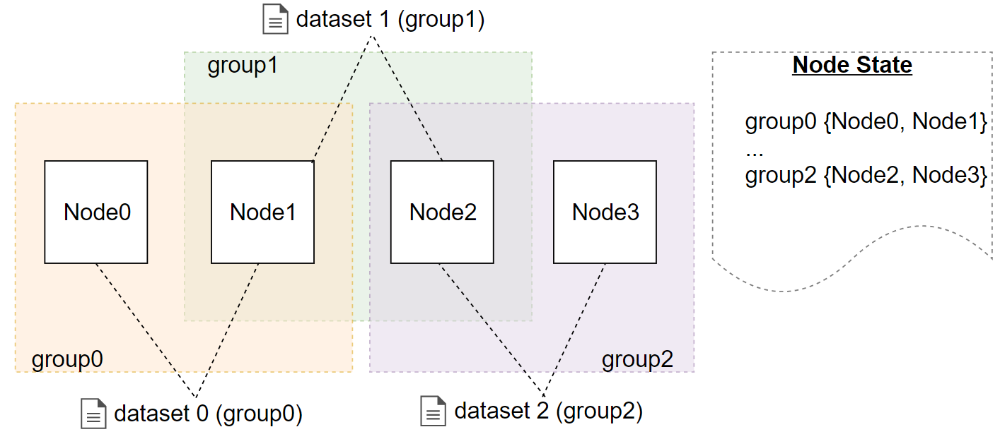

.. _data-privacy:

Обмен конфиденциальными данными
====================================

Блокчейн-платформа Восток позволяет организовать передачу и хранение конфиденциальных данных между участниками сетевого взаимодействия. Защита конфиденциальных данных при их передаче и хранении обеспечивается набором политик (policy), которые содержат список участников и регулируют отношения сторон в рамках взаимодействия с приватными данными. 

Политики доступа
------------------------------

Политика доступа создаётся участниками, которым необходимо обменяться приватными данными. Политику доступа может создать любая нода-участник сети и включить в неё любой состав других нод сети. 

Параметры политики:

* автор;
* описание;
* список с адресами получателей конфиденциальных данных;
* список с адресами участников с правами администрирования политики.

Создание политики выполняется отправкой транзакции :ref:`CreatePolicyTransaction<CreatPolicyTransaction>`.
Владельцы политики имеют право изменять политику доступа путем отправки транзакции :ref:`UpdatePolicyTransaction <UpdatePolicyTransaction>`.

Для внешних приложений в :ref:`REST API ноды <privacy-api>` реализованs методы, возвращающие сведения по конфиденциальным данным и политикам доступа: ``GET /privacy/{policy}/recipients``, ``GET /privacy/{policy}/getHashes``, 
``GET /privacy/getInfo/{hash}``.

Отправка и получение данных
----------------------------------

Отправляемые данные пересылаются посредством ``POST /privacy/sendData`` запросом через собственную ноду организации, в которой проверяются принадлежность отправителя к указанной им политике. Если проверка выполнена успешно, то данные записываются в хранилище ноды и инициируется транзакция с посчитанной хеш-суммой от передаваемых данных. 

При получении транзакции с хеш-суммой от предаваемых данных принимающая сторона проверяет причастность блокчейн-узла организации к указанной в транзакции политике. Если участник состоит в политике, то выполняется запрос ``getPrivateData`` на получение конфиденциальных данных. Запрос выполняется по сетевому адресу участника политики. Для обеспечения безопасности при передачи данных по незащищенному каналу связи используеются набор алгоритмов: шифрования на симметричном ключе, создания сессионных ключей и протокол Диффи - Хеллмана.